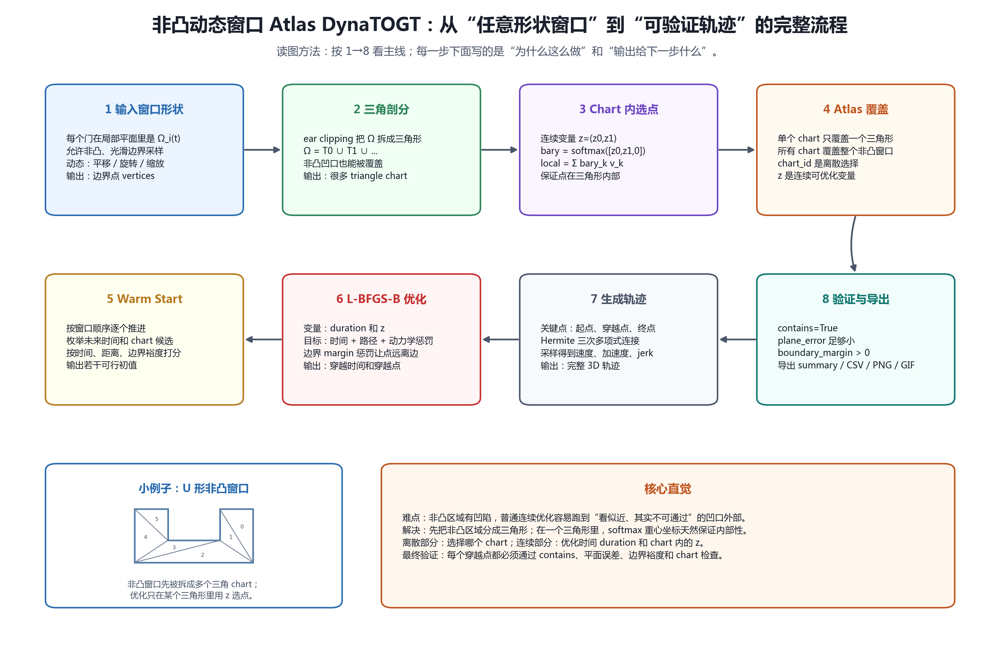
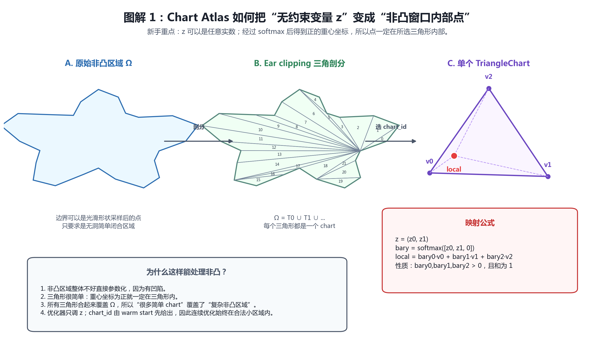
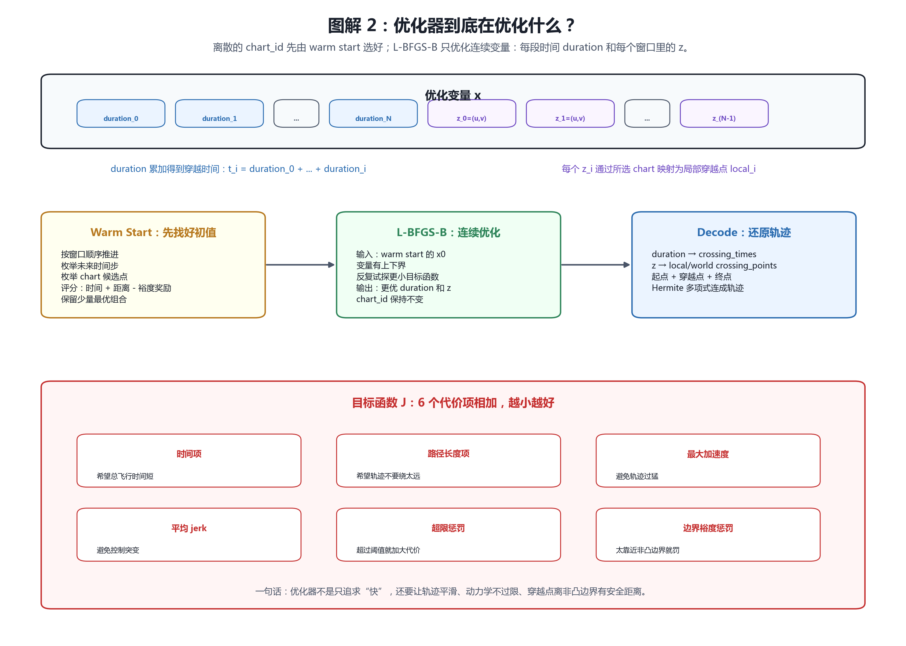
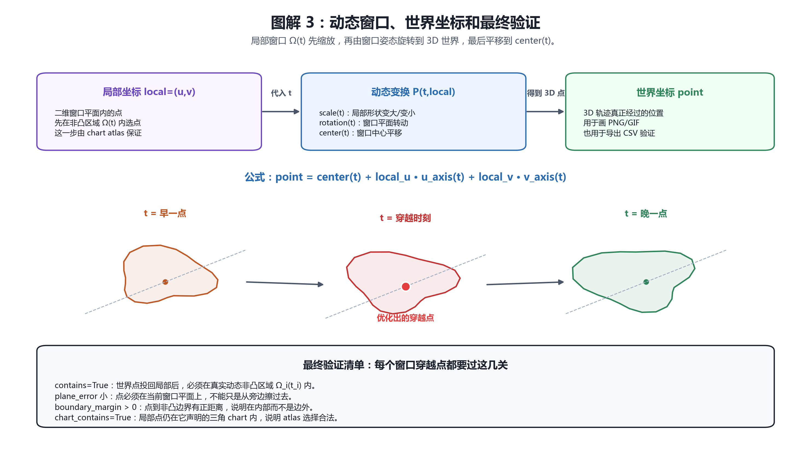
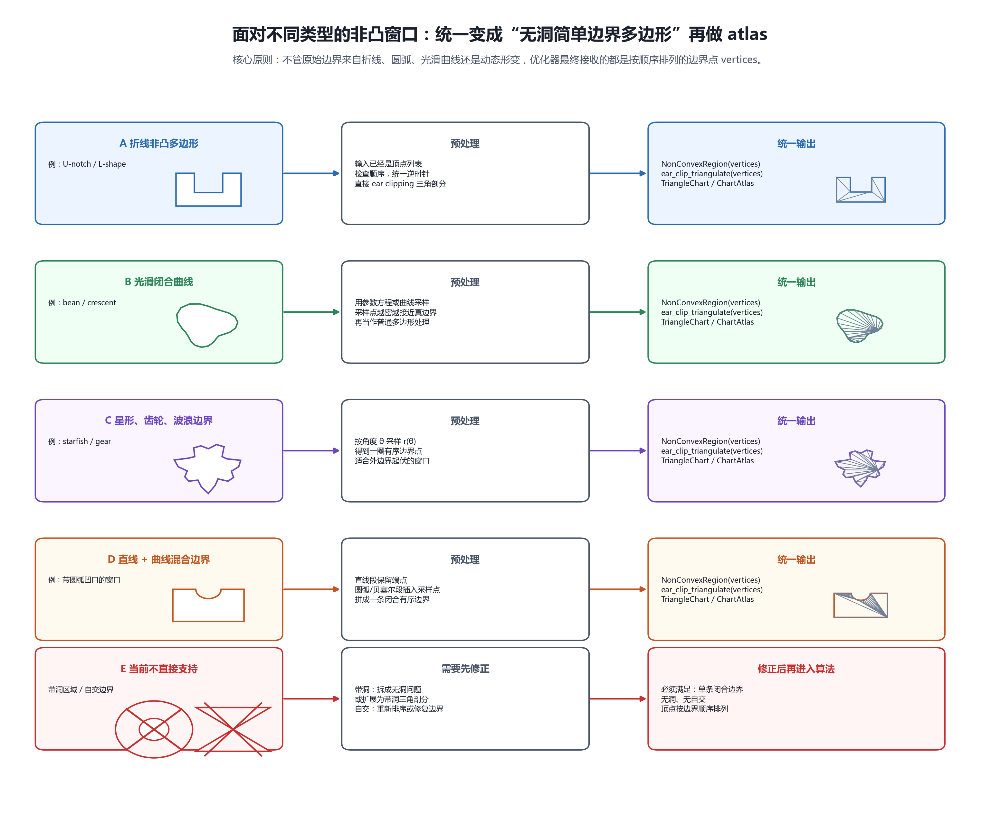
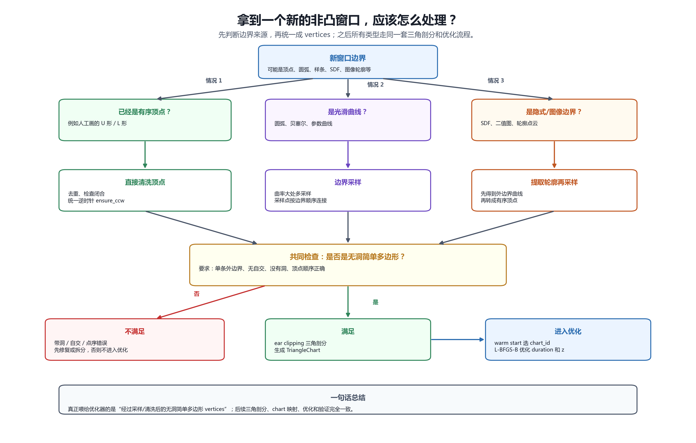

# 非凸 Atlas DynaTOGT 算法

## 图解总览

下面 4 张图按“总览 -> 局部细节 -> 优化过程 -> 验证过程”组织。PNG 适合直接查看，旁边同名 SVG 适合放大或继续编辑。













## 1. 非凸区域表示

每个窗口的局部可通行区域是无洞简单二维区域：

```text
Omega_i(t) subset R^2
```

工程实现中，光滑或任意形状边界会先采样成简单多边形。动态变化包括：

- 平移：改变窗口三维中心；
- 旋转：改变窗口三维姿态；
- 缩放：改变局部二维区域的 u/v 尺度。

### 1.1 不同类型非凸窗口的处理方式

无论窗口原始边界长什么样，当前算法都会先把它统一成：

```text
按边界顺序排列的 vertices
```

也就是一个“无洞、无自交、简单闭合”的边界多边形。之后所有类型都走同一条流程：

```text
vertices -> NonConvexRegion -> ear clipping -> TriangleChart / ChartAtlas -> 优化
```

| 窗口类型 | 具体处理 |
|---|---|
| 折线非凸多边形，例如 U 形、L 形 | 直接使用顶点列表，检查点序并统一为逆时针，然后三角剖分 |
| 光滑闭合曲线，例如月牙、豆形 | 沿边界采样成密集折线点，采样点越密越接近真实曲线 |
| 星形、齿轮、波浪边界 | 通常用极坐标或参数方程采样，得到一圈有序边界点 |
| 直线 + 曲线混合边界 | 直线段保留端点，圆弧/贝塞尔段插入采样点，再拼成闭合边界 |
| 动态平移/旋转/缩放窗口 | 局部区域先建 atlas；运行时按 `scale(t)` 缩放，再旋转和平移到世界坐标 |
| 带洞或自交边界 | 当前版本不直接支持；需要先拆成无洞问题、修复点序，或扩展为带洞三角剖分 |

## 2. Chart Atlas

对每个局部区域做三角剖分：

```text
Omega = union_j T_j
```

每个三角形 `T_j` 是一个 chart。给定无约束变量：

```text
z = (z0, z1)
```

构造 softmax 重心坐标：

```text
bary = softmax([z0, z1, 0])
```

局部穿越点为：

```text
local = bary0 * v0 + bary1 * v1 + bary2 * v2
```

因为 `bary_k > 0` 且 `sum(bary)=1`，所以点严格位于该三角形内部。单个 chart 关于 `z` 可微；所有 chart 并集覆盖非凸区域，因此 atlas 对整个区域满射覆盖。

## 3. 优化变量

chart id 是离散变量，由 warm start beam search / multi-start 选择。L-BFGS-B 只优化连续变量：

```text
[duration_0 ... duration_N,
 z_0_u z_0_v ... z_(N-1)_u z_(N-1)_v]
```

其中 `duration` 的累计和给出每个穿越时间 `t_i`，每个 `z_i` 在固定 `chart_id_i` 内映射为局部穿越点。

## 4. Warm Start

warm start 阶段按窗口顺序推进：

1. 根据当前点和最大速度估计最早可达时间步；
2. 在未来若干时间步枚举窗口 chart 候选；
3. 用飞行时间、路径距离和边界裕度给候选评分；
4. beam search 保留若干条 chart 组合；
5. 把候选局部点反变换为 softmax logits，作为 L-BFGS-B 初值。

## 5. 连续优化目标

目标函数沿用 DynaTOGT 风格：

```text
总时间
+ 路径长度
+ 最大加速度
+ 平均 jerk
+ 速度/加速度/jerk 超限惩罚
+ 非凸边界安全裕度惩罚
```

几何内部性由 chart 映射保证；边界裕度惩罚用于鼓励穿越点远离非凸边界。

## 6. 验证标准

每次穿越必须满足：

- `contains=True`：世界点位于当前动态非凸窗口内；
- `plane_error` 足够小：点在窗口平面上；
- `boundary_margin > 0`：点在非凸边界内部；
- `chart_contains=True`：局部点位于对应三角 chart 内。

这些字段会写入导出的 CSV，作为数值证据。
