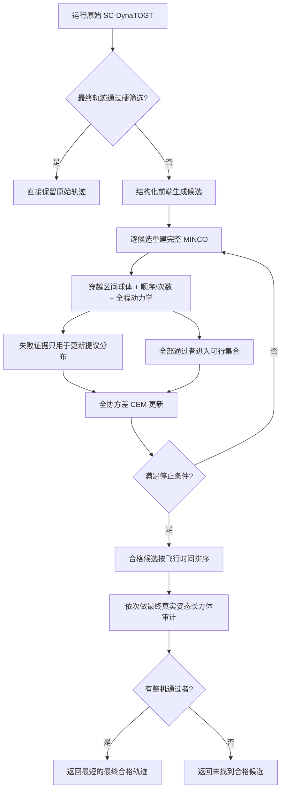

# Feasibility-Guided CEM SC-DynaTOGT：完整算法流程

更新：2026-09-09。

## 1. 算法要解决什么问题

原始 SC-DynaTOGT 用 L-BFGS 联合优化窗口内穿越位置和各段时间。它的目标包含飞行时间与采样动力学罚项，但问题是非凸的，动力学又以软罚项进入目标，因此“优化器收敛”不等于“最终轨迹满足全部硬约束”。实际可能出现两类情况：

1. L-BFGS 停在不合格的局部解；
2. 软罚项允许短时、幅度较小的动力学越界，而最终验收要求严格通过。

本算法在原始 SC-DynaTOGT 最终轨迹不合格时启动。它不替换 SC、MINCO 或四旋翼动力学模型，而是在同一个原生决策空间中，用结构化前端和可行性引导的 Cross-Entropy Method（CEM）搜索新的候选。最终只接受全部硬条件通过的轨迹：

\[
x^*=\arg\min_{x\in\mathcal C_{\mathrm{final}}}T(x),
\]

其中

\[
\mathcal C_{\mathrm{final}}
=\{x:\text{中间硬筛选通过，且最终整机审计通过}\}.
\]

若这个集合为空，算法返回 `NO_FEASIBLE_CANDIDATE_FOUND`，不会返回“违规最少”的轨迹。

当前名称 **Feasibility-Guided CEM SC-DynaTOGT** 是本项目中的研究原型名称，不是已有论文中同名算法。

## 2. 问题模型与决策变量

设赛道有 \(L\) 个窗口，按指定顺序各穿越一次。当前实验中窗口中心和平面固定，窗口以常角速度绕平面法向自旋：

\[
\theta_i(t)=\theta_{i,0}+\omega_i t.
\]

窗口可以是非凸简单区域；曲线边界在预处理阶段按几何误差要求离散，再对安全内缩区域拟合圆盘 Schwarz–Christoffel（SC）映射。算法不使用凸包替代真实非凸开口。

### 2.1 原生变量

搜索变量与原始 SC-DynaTOGT 完全一致：

\[
x=[K_0,\ldots,K_L,d_{1x},d_{1y},\ldots,d_{Lx},d_{Ly}]
\in\mathbb R^{3L+1}.
\]

- \(K_j\) 是第 \(j\) 段的无约束时间变量；
- \(D_i=(d_{ix},d_{iy})\) 是第 \(i\) 个窗口的二维无约束穿越位置变量。

### 2.2 正时间映射

原 TOGT 正时间映射把任意 \(K_j\) 变为正时长：

\[
T_j=\tau(K_j)=
\begin{cases}
(\tfrac12K_j+1)K_j+1, & K_j>0,\\
\bigl((\tfrac12K_j-1)K_j+1\bigr)^{-1}, & K_j\le 0.
\end{cases}
\]

第 \(i\) 个窗口的绝对穿越时刻为前缀和：

\[
t_i=\sum_{j=0}^{i}T_j.
\]

改变一个早期 \(K_j\) 会同时改变后续多个窗口的到达相位，因此多个 \(K\) 之间必须相关搜索。

### 2.3 非凸窗口内的自由选点

每个 \(D_i\) 先映入开单位圆盘：

\[
B(D_i)=\frac{D_i}{\sqrt{1+\lVert D_i\rVert^2}},
\]

再经窗口安全内缩区域的 SC 映射 \(\Psi_i\) 得到局部穿越点：

\[
q_i=\Psi_i(B(D_i)).
\]

固定平面自旋窗口中的世界穿越点为

\[
p_i(t_i)=c_i+E_iR(\theta_i(t_i))q_i,
\]

其中 \(c_i\) 是固定中心，\(E_i\) 是固定平面基，\(R(\theta)\) 是二维面内旋转。

### 2.4 轨迹生成

起点、\(L\) 个世界穿越点、终点和 \(L+1\) 段时长共同生成 degree-7 MINCO minimum-snap 轨迹。起终状态约束位置、速度、加速度和 jerk；相邻多项式段保持到三阶导数连续。

本算法的每个候选都重新计算：

1. 正段时长和累计穿越时刻；
2. 各时刻窗口姿态与世界穿越点；
3. 完整 MINCO 系数；
4. 球体安全、穿越顺序和动力学。

因此，候选不是对既有轨迹做几何平移，也不是只改一个记录中的时间数字。

## 3. 总体流程



流程分为四层：

1. 原始 SC-DynaTOGT 基线；
2. 针对场景结构的前端；
3. 可行性引导的全协方差 CEM；
4. 只对中间合格候选执行的最终整机审计。

## 4. 第一层：原始 SC-DynaTOGT 基线

先使用原始目标、解析梯度和 L-BFGS 求解一次 \([K,D]\)。该解承担两个作用：

- 若硬筛选通过，它本身就是可返回轨迹，无需启动随机搜索；
- 若失败，它给出一个已有局部解，作为结构化前端或 CEM 的中心。

这里必须区分三个概念：

- `optimizer_success=true`：L-BFGS 满足自身停止条件；
- 目标函数局部最优：只相对于当前非凸盆地和数值终止精度；
- 轨迹合格：所有硬几何、动力学和整机条件都通过。

前两个都不能替代第三个，也不能解释为全局最优。

## 5. 第二层：结构化前端

结构化前端负责把搜索中心先移到“接近可行边界”的区域。当前有两种场景实例化，它们共享后续 CEM 和硬验收。

### 5.1 高速同形窗口：安全相位周期别名前端

三 U 窗、18 rad/s 实验使用两条已经独立通过单窗硬筛选的轨迹作为模板。每条模板提供：

- 安全穿越相位 \(\phi_m\)；
- 对应的二维 SC 变量 \(D_m\)。

对第 \(i\) 个匀速旋转窗口枚举周期整数 \(n\)，使

\[
t_{i,m,n}=\frac{\phi_m-\theta_{i,0}+2\pi n}{\omega_i}.
\]

然后组合各窗口的到达时刻，并只保留满足以下范围的组合：

- 第一窗到达时间：1.0–3.0 s；
- 相邻窗口间隔：1.1–2.8 s；
- 最大到达时刻：14.0 s；
- 末段时长枚举：1.37/1.8/2.2 s。

到达时刻差分得到各段 \(T\)，再反解为原生 \(K\)，模板提供原生 \(D\)。每个组合都重建并筛查整条轨迹。

如果前端已经有全硬筛选通过者，选择其中最短者作为 CEM 中心；否则从三窗几何和顺序全部通过的候选中，选择最大速度最低者作为中心。这个中心仍不是最终输出。

### 5.2 异形曲线窗口：共同时间伸缩前端

利马松、五瓣波浪和直线–Bézier 混合窗口没有可直接复用的同形单窗相位模板，因此曲线赛道采用共同时间伸缩：

\[
T^{(a)}=aT^{\mathrm{SC}},\qquad a\in[1.0,1.65].
\]

当前用 40 个等距尺度。\(D\) 暂时保持为原始 SC 解，\(T^{(a)}\) 反解为 \(K^{(a)}\)。由于穿越时刻改变，窗口相位和世界穿越点会随每个候选重新计算。

如果前端存在全硬筛选通过者，取最短者作为 CEM 中心；否则按下一节的提议排序规则选中心。

这两个前端属于同一算法框架的场景特定初始化。相位周期别名适合多个同形高速周期窗口；共同时间伸缩适合缺少已验证单窗模板的异形赛道。二者不应混写成一条对所有场景固定不变的步骤。

## 6. 第三层：可行性引导的全协方差 CEM

### 6.1 为什么不直接在笛卡尔 \(D\) 上独立加噪声

原来的 Random-DK 为每个变量独立采样，难以表达以下关系：

- 多个航段需要一起变慢；
- 某一段变长时，相邻窗口的穿越点也要随之变化；
- \(D\) 模长很大时，笛卡尔小扰动对圆盘内实际位置的作用高度不均匀。

新算法把每组 \(D_i\) 写成极坐标：

\[
D_i=e^{\ell_i}
\begin{bmatrix}
\cos\alpha_i\\
\sin\alpha_i
\end{bmatrix},
\]

并在潜变量

\[
y=[K_0,\ldots,K_L,\alpha_1,\ldots,\alpha_L,
\ell_1,\ldots,\ell_L]
\]

上学习完整协方差。

### 6.2 初始分布

初始均值是前端选出的中心 \(y_0\)。时间变量标准差通过正时间映射的雅可比归一化：

\[
\sigma_{K_j}=\frac{\sigma_T}{\partial\tau(K_j)/\partial K_j}.
\]

这样配置中的“0.035 s”或“0.06 s”表达的是近似实际时长扰动，而不是不同 \(K\) 区域中含义不一致的参数幅度。

时间协方差还增加共同分量：

\[
\Sigma_{KK}=\operatorname{diag}(\sigma_{K_j}^2)+uu^\mathsf T,
\qquad
u_j=\frac{\sigma_{T,\mathrm{common}}}
{\partial\tau(K_j)/\partial K_j}.
\]

它允许所有航段相关地变快或变慢。角度和对数模长使用各自固定初始方差。

### 6.3 候选评估

每轮从

\[
y^{(s)}\sim\mathcal N(\mu,\Sigma)
\]

采样一个种群，解码回原生 \([K,D]\)，重建完整轨迹并执行中间硬筛选。

失败信息只决定下一轮分布往哪里移动。当前提议优先级依次为：

1. 全部中间硬约束通过；同类中飞行时间更短者优先；
2. 几何和顺序通过、仅动力学失败；同类中最大速度更低者优先；
3. 穿越次数或顺序失败；
4. 球体安全失败；先比较已经通过的窗口数，再比较首个失败窗口的球体余量；
5. SC 成员关系、数值失败等其他情况。

这一排序仅服务于精英选择，绝不改变最终合格条件。例如最大速度为 7.000001 m/s 的轨迹仍是失败候选，不能排进最终结果。

### 6.4 精英、记忆与完整协方差更新

每轮把当前种群与上一轮保留的记忆样本合并，按提议优先级选出精英。令精英样本均值和协方差为 \(\hat\mu,\hat\Sigma\)，更新为

\[
\mu^+=\beta\mu+(1-\beta)\hat\mu,
\]

\[
\Sigma^+=\beta\Sigma+(1-\beta)\hat\Sigma+\Sigma_{\mathrm{floor}}.
\]

当前 \(\beta=0.3\)。协方差下限防止分布过早塌缩；历史记忆让好的候选不会因下一轮随机波动立即消失。使用完整 \((3L+1)\times(3L+1)\) 协方差，使时间和空间变量能够联合变化。

### 6.5 停止条件

最多运行配置给定的轮数。首次出现中间硬筛选通过者后，再额外运行一轮，然后停止。这一额外轮用于在已经找到的可行区域附近继续缩短时间。

当前典型参数为：

|参数|三 U 窗|曲线三窗|
|---|---:|---:|
|种群|256|256|
|精英|32|32|
|记忆|16|16|
|最多轮数|20|12|
|首次可行后追加轮数|1|1|
|独立时间标准差|0.035 s|0.06 s|
|共同时间标准差|0.025 s|0.08 s|
|角度标准差|0.035 rad|0.08 rad|
|对数模长标准差|0.18|0.22|

## 7. 中间硬筛选

中间筛选的目标是快速淘汰候选，因此整机先用安全球包络，并且几何计算只覆盖窗口的穿越接触区间。

### 7.1 结构、边界与连续性

先检查：

- 起终 PVAJ 与给定边界状态一致；
- 相邻 MINCO 段 0–3 阶导数连续；
- 数值全部有限。

### 7.2 SC 成员关系与穿越点一致性

每个局部点必须被真实安全内缩多边形覆盖；轨迹在记录的穿越时刻必须等于该窗口旋转到世界系后的穿越点。

### 7.3 球体到实体平面开口补集的约束

整机中间包络半径为

\[
r_s=r_{\mathrm{body}}+r_{\mathrm{margin}}.
\]

对第 \(i\) 个窗口，把球心转到窗口坐标系，得到面内投影 \(q_i(t)\) 和法向坐标 \(z_i(t)\)。实体障碍集合是物理开口在整张平面内的闭补集 \(\mathcal F_i\)。球心到三维实体门框的距离满足

\[
d_{i,\mathrm{3D}}^2(t)
=z_i^2(t)+d_{\mathcal F_i}^2(q_i(t)).
\]

安全约束为

\[
z_i^2(t)+d_{\mathcal F_i}^2(q_i(t))-r_s^2\ge0.
\]

当 \(|z_i(t)|>r_s\) 时约束自动满足，因此实现先数值求多项式与 \(z=\pm r_s\) 的交点，只在全部 \(|z_i(t)|\le r_s\) 区间检查。对于零厚度窗口，这就是用户给定约束的直接实现。

当前筛查采用：

- 旋转感知粗网格：最大 2 ms，同时限制相邻样本旋转不超过约 1°；
- 密集网格：最大 0.2 ms；
- 小于 5 mm 余量或局部极小值附近：最大 0.05 ms 再细化；
- 区间端点、平面穿越根和接触根强制加入网格。

根求解和距离检查都是数值方法，因此结果是密集采样证据，不是连续时间证明。

### 7.4 穿越次数与顺序

每个窗口必须恰有一个有效平面穿越根，并与规划穿越时刻一致；多个窗口的穿越根必须严格递增。

### 7.5 全程动力学

几何筛查通过后，以最大 1 ms 网格检查完整轨迹：

- 最大速度；
- 总推力上下界；
- XY/Z 机体角速度；
- 四个单旋翼推力上下界。

任意一项失败，候选立即从最终集合排除。

## 8. 第四层：最终整机审计

所有中间合格候选按总飞行时间从短到长排序。只对这些候选执行真实姿态长方体审计：

1. 从轨迹加速度、jerk 和 snap 恢复四旋翼姿态；
2. 计算有向长方体与每个窗口平面相交时的截面；
3. 检查截面是否完全位于当时的真实物理开口内；
4. 对每个窗口检查全程、一次有效穿越、顺序和动力学；
5. 最大约 0.2 ms 网格，并在关键时刻细化。

按时间排序后的第一个整机通过者就是最终输出。若第一个失败，则继续审计下一名；中间筛选失败者永远不会进入这一阶段。

这里的“整机通过”仍是名义模型下的密集采样结论，不是连续域认证、跟踪鲁棒性证明或真机验收。

## 9. 伪代码

```text
input: scenario, original SC solution x_sc, frontend configuration, CEM budget

if HardScreen(x_sc) passes and CuboidAudit(x_sc) passes:
    return x_sc

front_rows = StructuredFrontend(x_sc, scenario)
for x in front_rows:
    trajectory = RebuildSC_MINCO(x)
    screen[x] = HardScreen(trajectory)

if any front row passes:
    center = shortest passing front row
else:
    center = best proposal-only front row

(mu, Sigma) = InitializePolarFullCovariance(center)
memory = empty
all_rows = front_rows

for round in 0 ... maximum_rounds-1:
    population = SampleNormal(mu, Sigma)
    evaluate every sample with RebuildSC_MINCO + HardScreen
    all_rows += population

    elite = top proposal-ranked samples from population + memory
    update mu and full Sigma with smoothing and covariance floor
    memory = best retained elite samples

    if a feasible sample has appeared and one extra round is complete:
        break

ranked = sort only HardScreen-passing rows by flight time
for x in ranked:
    if CuboidAudit(x) passes:
        return x

return NO_FEASIBLE_CANDIDATE_FOUND
```

## 10. 两次已运行实例

### 10.1 三个高速 U 窗口

- 结构化前端：安全相位周期别名；
- 前端评估：2820；
- CEM：7 轮、1792 个候选；
- 中间全部通过：3；
- 最终轨迹：7.390546627 s；
- 动力学与三个窗口整机审计：全部通过。

完整数字见 [THREE_WINDOW_RESULTS.md](THREE_WINDOW_RESULTS.md)。

### 10.2 利马松–波浪–直线/Bézier 曲线赛道

- 结构化前端：40 个共同时间尺度；
- CEM：2 轮、512 个候选；
- 总候选：552；
- 中间全部通过：309；
- 最终轨迹：3.468057675 s；
- 动力学与三个窗口整机审计：全部通过。

对照结果：Fixed-WP 为 3.878918907 s、原始 SC-DynaTOGT 为 3.497544115 s；两者碰撞约束通过，但单旋翼推力约束失败，按硬规则淘汰。详见[曲线赛道三方法结果](../comparisons/curved_rotating_sc_fixed_wp/results/three_way_20260909/REPORT.md)。

## 11. 代码对应关系

|流程|实现|
|---|---|
|原生多窗 SC/MINCO 适配|`random_dk_sc_dynatogt/multi_window.py::MultiWindowObjective`|
|球体区间与动力学硬筛选|`random_dk_sc_dynatogt/safety.py`|
|相位周期别名前端|`search.py::phase_front_end`|
|极坐标编码/解码|`search.py::polar_encode/polar_decode`|
|全协方差 CEM|`search.py::local_cem_search`|
|硬可行集合排序|`search.py::feasible_rank`|
|三 U 窗入口|`multi_window.py`|
|曲线赛道时间前端与三方对比|`../comparisons/curved_rotating_sc_fixed_wp/three_way.py`|
|最终多窗整机审计|`random_dk_sc_dynatogt/multi_window.py::audit_multi`|

## 12. 参考工作与本算法的关系

### 12.1 TOGT：基础变量、轨迹与动力学

Qin、Michet、Chen、Liu，[*Time-Optimal Gate-Traversing Planner for Autonomous Drone Racing*](https://arxiv.org/abs/2309.06837)，arXiv:2309.06837v3，2024。

采用内容：门形状参与优化、窗口内自由选点、无约束正时间变量、MINCO 多项式轨迹、微分平坦性动力学和单旋翼推力约束。本文档中的原始 SC-DynaTOGT 基线建立在这一框架上。

没有照搬的部分：TOGT 原文不包含本项目的动态自旋非凸 SC 窗口、球体穿越区间筛查或 Feasibility-Guided CEM。

### 12.2 MINCO/GCOPTER：稀疏时空参数化

Wang、Zhou、Xu、Gao，[*Geometrically Constrained Trajectory Optimization for Multicopters*](https://arxiv.org/abs/2103.00190)，IEEE Transactions on Robotics，2022。

采用内容：用稀疏空间点和时间变量生成 minimum-control 多项式轨迹，并对时空变量做高效变形与梯度优化。

没有照搬的部分：本文的非凸 SC 映射、旋转窗口相位前端和 CEM 搜索不是该论文的算法模块。

### 12.3 iCEM：相关采样与记忆

Pinneri 等，[*Sample-efficient Cross-Entropy Method for Real-time Planning*](https://proceedings.mlr.press/v155/pinneri21a.html)，CoRL 2020 / PMLR 155，2021。

采用的启发：CEM 的迭代分布更新、相关采样、保留历史好样本和首次找到好区域后继续局部改进。

本项目自己的改动：在 \([K,\alpha,\log r]\) 上使用完整协方差；用 TOGT 时间雅可比定义实际时间尺度；用分层可行性证据选精英；最终结果只从硬可行集合产生。当前实现不是 iCEM 的逐项复现，也不继承其论文中的实时性结论。

### 12.4 RSS 2020：把动力学可行性当作黑盒边界

Ryou、Tal、Karaman，[*Multi-Fidelity Black-Box Optimization for Time-Optimal Quadrotor Maneuvers*](https://www.roboticsproceedings.org/rss16/p032.html)，Robotics: Science and Systems，2020，DOI: 10.15607/RSS.2020.XVI.032。

采用的启发：时间最优解通常位于动力学可行域边界附近；完整轨迹可以通过可行/不可行评估指导下一次搜索；失败评估也包含信息。

没有照搬的部分：当前实现没有 Gaussian Process、Bayesian optimization、多保真仿真或真机实验。这里只用确定性的名义模型采样筛查和 CEM 分布更新。

### 12.5 Schwarz–Christoffel 映射

Driscoll、Trefethen，[*Schwarz–Christoffel Mapping*](https://tobydriscoll.net/book/schwarz-christoffel-mapping/index.html)，Cambridge University Press，2002。

采用内容：从单位圆盘到简单多边形内部的共形映射，为非凸安全区提供无约束内部点参数化。

## 13. 当前限制

- CEM 是随机方法；单种子成功不代表统计成功率。
- 当前前端需要按场景选择，相位模板不能直接跨不同窗口形状复用。
- 提议排序中的动力学失败目前主要用最大速度继续排序，对单旋翼推力违规程度利用不足。
- 球体筛查、动力学和整机审计都是数值采样；没有连续域安全证书。
- 当前模型是假定已知的固定平面、固定中心、面内匀速旋转；不能直接外推到完整平移/RPY 时变窗口。
- 当前是离线规划与名义模型验收，没有计入状态估计、控制跟踪误差、气动效应和真机扰动。
- 找不到候选只表示当前前端、种子和预算没有找到解，不证明问题全局不可行。
