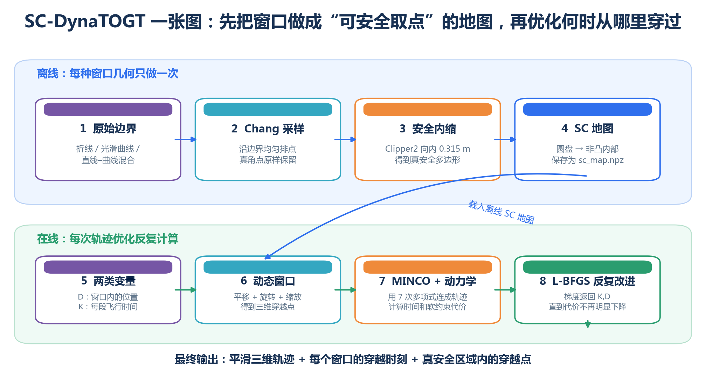
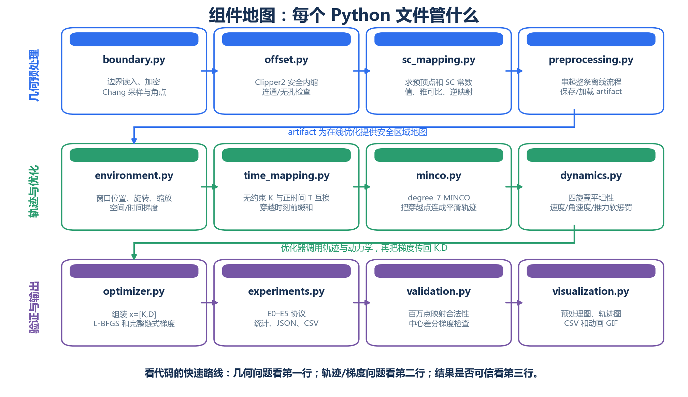
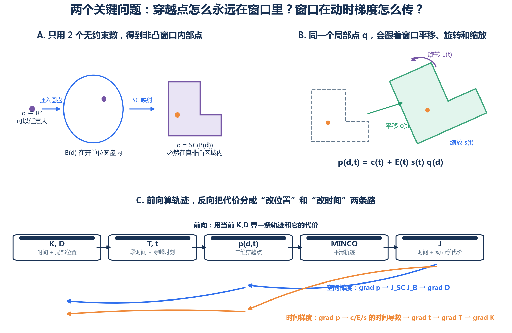
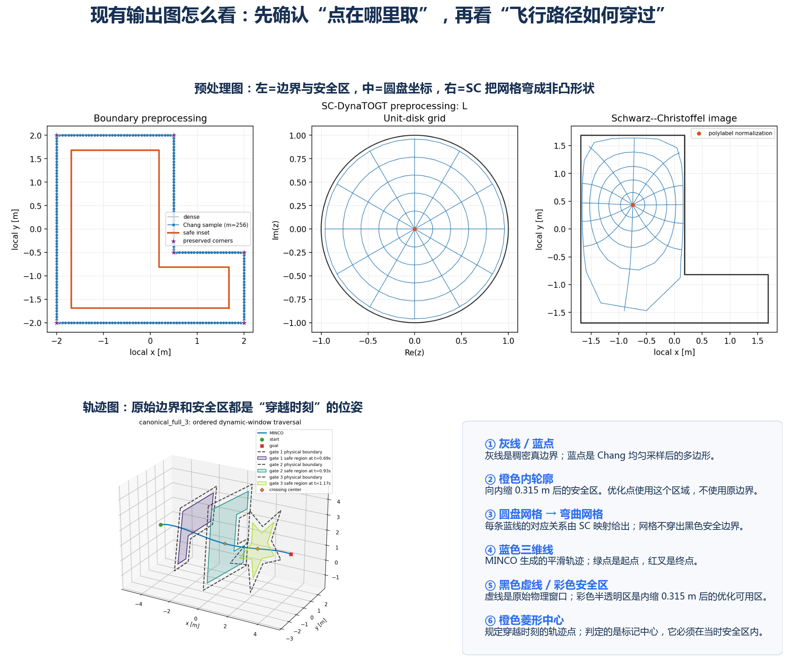
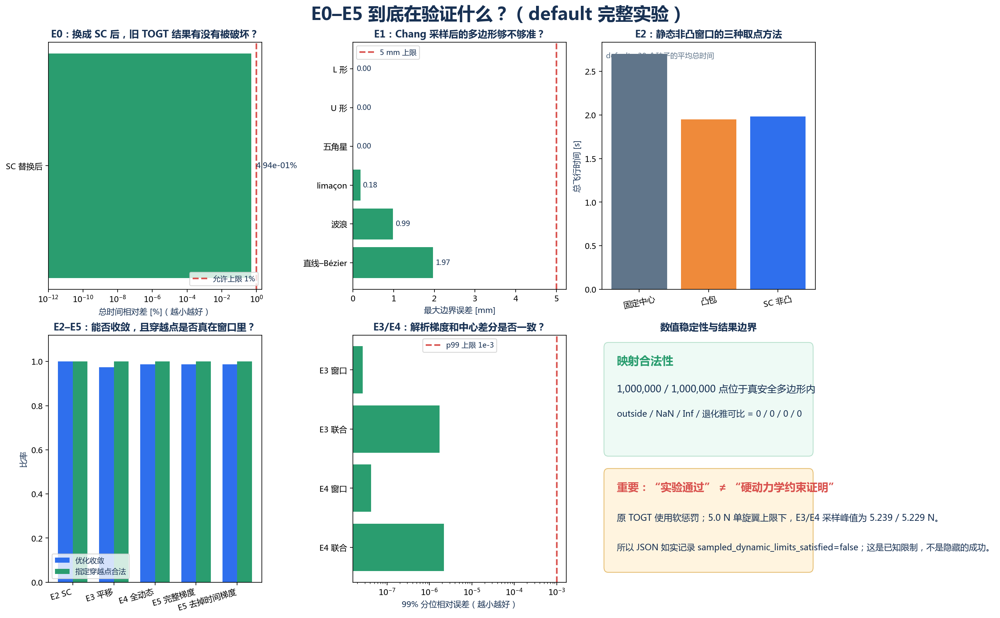

# SC-DynaTOGT 图解指南

如果公式看起来太抽象，建议按 **1 → 4 → 5 → 3 → 2** 的顺序看下面五幅图。

## 1. 整个算法在做什么



只要先记住四句话：

1. Chang 只负责把边界采样得整齐，不负责窗口内部取点。
2. Clipper2 把边界向内缩 `0.315 m`，留出真正可用的安全区。
3. Schwarz–Christoffel（SC）把圆盘内的点映射到非凸安全区内。
4. TOGT 同时调整“从哪里穿”和“什么时候穿”，MINCO 把这些穿越点连成平滑轨迹。

## 2. 各个代码组件管什么



这幅图主要用来“找代码”：

- 边界或 SC 映射出问题：看第一行。
- 轨迹、时间或动力学出问题：看第二行。
- 想知道实验为什么成功/失败：看第三行的 `experiments.py` 和 `validation.py`。

## 3. SC 取点、动态窗口和梯度



上半部解释两件事：

- 优化器不用直接处理复杂的非凸边界，只调整两个无约束数 `d`；`B(d)` 把它压入圆盘，SC 再把它送入真安全区。
- 局部点 `q` 不变，三维点 `p` 会跟随窗口的平移 `c(t)`、旋转 `E(t)` 和缩放 `s(t)` 运动。

下半部是反向传播：代价对穿越点的影响分成两条路，一条改空间变量 `D`，另一条通过窗口运动和穿越时刻改时间变量 `K`。

## 4. 预处理图和三维轨迹图怎么看



最简单的判断方法是：

- 预处理图里，SC 弯曲后的蓝色网格不应跑出黑色安全边界。
- 轨迹图里，黑色虚线是原始物理窗口，彩色半透明区是向内缩 `0.315 m` 后的安全区。
- 橙色菱形的中心是规定穿越时刻的轨迹点，它应在当时彩色安全区内；标记本身的边缘可以跨过线条，不代表点中心越界。
- 两层窗口都不是初始时刻的固定形状，而是轨迹穿过它时的位置、角度和尺寸。

## 5. E0–E5 实验结果是什么意思



| 实验 | 想回答的问题 |
|---|---|
| E0 | 把原凸窗口取点换成 SC 后，有没有破坏旧 TOGT 结果？ |
| E1 | Chang 采样得到的多边形与真边界的误差是否小于 5 mm？ |
| E2 | 在静态非凸窗口里，固定中心、凸包和 SC 取点有什么差别？ |
| E3 | 窗口只平移时，位置时间梯度是否正确？ |
| E4 | 窗口同时平移、旋转和缩放时，完整链条是否可用？ |
| E5 | 把窗口时间梯度关掉后，优化行为有什么变化？ |

使用 `results/smoke` 生成时，每个动态组只有 1 次单窗口运行，只证明调用链能跑通。使用 `results/default` 生成时，面板会标明完整样本数，动态代表轨迹包含 L、U、五角星 3 个窗口。右下角的黄色框仍会提醒：原 TOGT 是动力学软惩罚，所以“轨迹优化收敛”不等于“所有时刻都已获得硬约束证书”。

## 重新生成

先运行 smoke 实验，再生成图解：

```bash
python -m nonconvex_timevarying_window.sc_dynatogt.experiments \
  --suite smoke \
  --outdir nonconvex_timevarying_window/sc_dynatogt/results/smoke

python -m nonconvex_timevarying_window.sc_dynatogt.explain_figures \
  --results nonconvex_timevarying_window/sc_dynatogt/results/smoke \
  --outdir nonconvex_timevarying_window/sc_dynatogt/algorithm_figures
```

完整实验结束后，把 `--results` 换成 `nonconvex_timevarying_window/sc_dynatogt/results/default` 即可生成正式结果图解。
